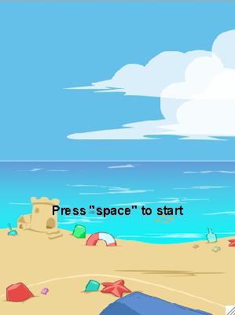
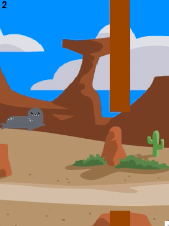
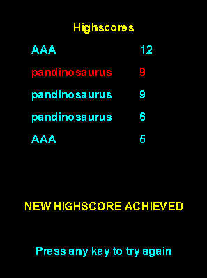

<h1> Flying-Seal </h1>

 An addictive desktop arcade game based on the "Flappy Bird" concept.  

<h2> History </h2>

 Sealy is not like the other seals : he can fly!   Thanks to this ability, the elders asked him to travel the world to find the mysterious Seal Sea...   Are you ready to fly for a fantastic journey with Sealy? 
 
<h2> Video </h2>
   
 

<h2> Launch </h2> 

 >> python main.py 

<h2> Requirements </h2> 

 - Python 2.7   - Pygame 

<h2> Useful links </h2>

 https://www.python.org/downloads/   https://www.python.org/about/gettingstarted/   http://www.pygame.org/download.shtml    https://www.pygame.org/wiki/GettingStarted   https://stackoverflow.com/questions/22974339/pygame-installation-issue-in-mac-os 

